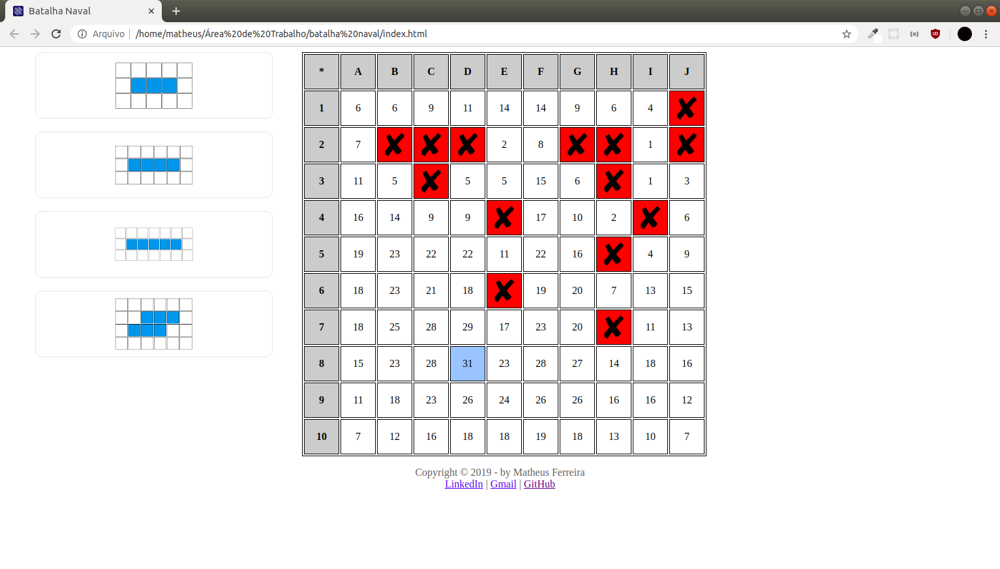

# Auxiliar de batalha naval
Esse auxiliar de batalha naval foi criado no desespero de um jogador programador hahaha ;D.

## Introdução
Vamos com os fatos, eu sou horrível no batalha naval e eu jogava um joguinho de celular chamado `Batalha Naval - Fleet Battle` que é um jogo online e que possui um sistema de ranking.

O jogo é bem simples, você busca um oponente e depois de encontra-lo os jogadores posicionam seus navios de diferentes formas e tamanhos por um campo de 10x10 e quando os dois estiverem prontos começam a tentar afundar os navios do oponente por turnos.

## Desenolvimento
Bom, como um bom programador eu pensei em criar um auxiliar que da sugestões de onde estão os navios do oponente através de probabilidade, veja bem, é como se eu tivesse um amigo ao lado me dando sugestões, não é hacker, outras pessoas tinham seres humanos dando palpites, eu só tinha a matemática através da programação hahaha.

Então eu apresento a vocês <b>O Auxiliador</b>

Ele funciona assim, no campo 10x10 existem vários números, quanto maior for o número maior é a probabilidade de ter um navio, o maior número está de azul para facilitar a visualização, a probabilidade é calculada dinamicamente de acordo com os navios que ainda estão "vivos" e as areas que ainda estão livres, então a cada tiro que você der no jogo você deve atirar tambem no auxiliador, a esquerda você tem de forma visual os navios que estão "vivos", conforme for afundando os navios é só exclui-lo clicando nele, assim vai ser calculado a probabilidade sem usar os navios que ja foram afundados.

simulando jogo em andamento:

Outro fato interessante é que o auxiliador exclui automaticamente areas que não cabem os navios que ainda estão vivos. Veja bem que essa imagem a seguir eu simulei uma área que dentre os navios que estão vivos só cabe um:

Agora eu vou clicar somente em um quadradinho dessa área e logicamente ele vai excluir toda a área, pois não cabe nenhum formato de navios "vivos" dentro dela:

## Conclusão
Minha porcentagem de vitória subiu de 40% para uns 70%, logicamente nem todos os jogos eu ganhava pois alem da probabilidade existe o fator sorte hahaha.

Hoje em dia eu não jogo mais, mas eu lembro que foi um projeto bem desafiador e divertido de fazer na época.
